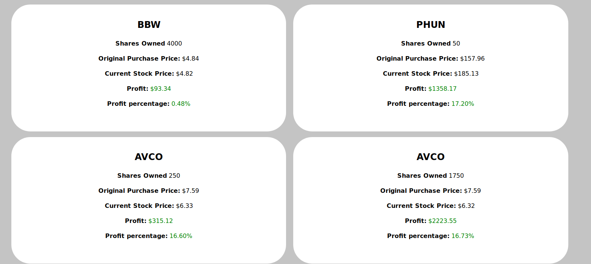

# Stock Market Game Dashboard
An alternative dashboard for the [Stock Market Game](https://www.stockmarketgame.org/) that provides easier viewing and more insights

# Overview
This program accepts a username and password, scrapes the data from the Stock Market Game site, and presents it in a lovely view. (See picture below)

# Installation & Setup
First, clone the repo and install the dependencies with [pipenv](https://pipenv.readthedocs.io/en/latest/)

`pipenv install`

Start the Flask server (stocks/app,py) and navigate to `/scrape`. Fill out the form, or send a POST request to `/scrape` with params username and password. Assuming the provided credentials are correct, it should scrape your data!

## Authentication
To make sure other traders aren't spying on your stock data, the application employs two authentication methods (only one is required).

- The Request IP is the same as the Server IP, or is localhost. This makes it easy to develop/test AND allows easy access on your local network (if the application is run on the LAN)
- A cookie with key `stocks_security` and a value that shares the contents of `code.txt`, on the server. To get the cookie. Go to `/verify` and paste in the contents of `code.txt`, which is a file generated in the root application directory after the first request is made. 

Once one of these two requirements are met, the client will be able to access `/scrape` and the dashboard at `/`

# Features

The top of the Dashboard has four main bubbles

- General Info: Team Name, Date Updated, and links to other sections
- Rankings: The rank held for the Region and Coordinator rankings
- Total Money: Gives a general overview of how much money is stored in stocks, shorts, and cash.
- General Stock Info: Stock Count, Top Performer, and Worst Performer; The performers have links for more detail

### Stock Breakdown

This section provides information for each stock owned. It provides

- Stock Type (Short or Long)
- Shares Owned
- Original Purchase Price
- Current Stock Price (as of yesterday's closing price)
- Unrealized Gains/Losses

An example can be seen in the photo below

### Recent Transactions

This section just shows the four most recent transactions from the "Transaction Notes" Page.

### Realized Gains/Losses

This pulls data from the Realized Gains/Losses page. It just shows stocks you've bought, then sold, and how well you ended up doing.

# Contributing/Future Development
This project wasn't really intended to be actively developed, and I'm mostly finished with it. BUT, if you want to file a bug, or submit a PR, or fork it and turn it into something more advanced, feel free.