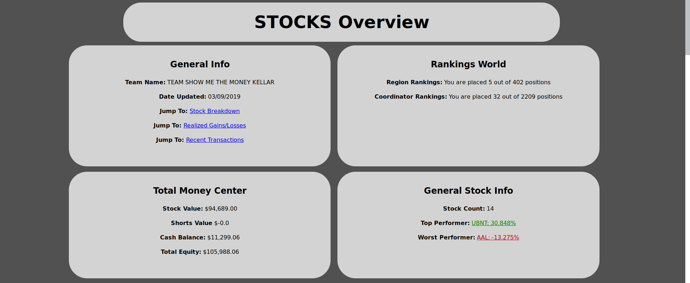
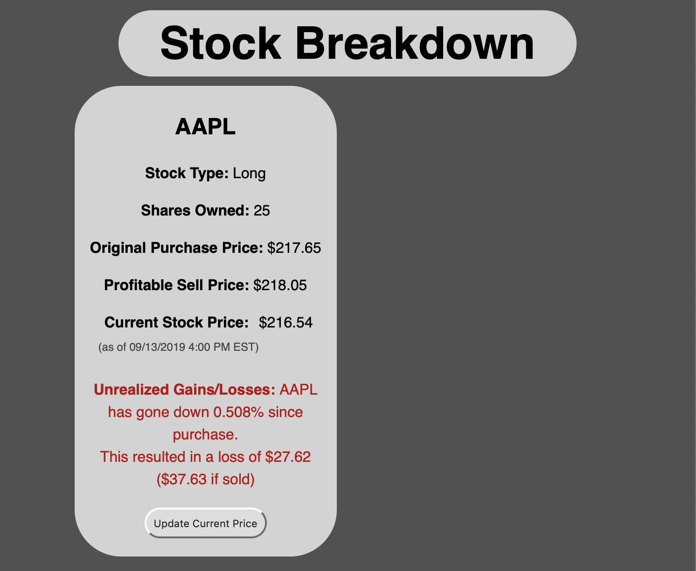
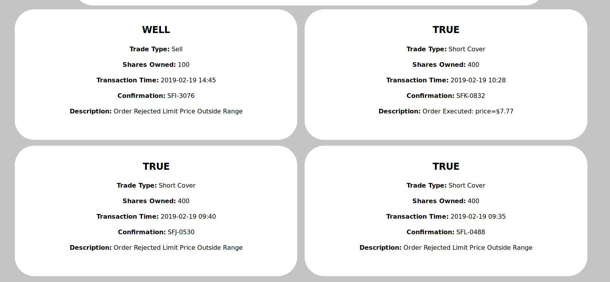

# Stock Market Game Dashboard
An alternative dashboard for the [Stock Market Game](https://www.stockmarketgame.org/) that provides easier viewing and more insights

# Overview
This program accepts a username and password, scrapes the data from the Stock Market Game site, and presents it in a lovely view. (See picture below)



# Installation & Setup
First, clone the repo and install the dependencies with [pipenv](https://pipenv.readthedocs.io/en/latest/)

`pipenv install`

Then, you need a config in the root folder of the repo called `config.json`, it should look needs two or three attributes

- An API Key for [Alpha Vantage](https://www.alphavantage.co/support/#api-key) to get current stock prices
- The current SEC fee per dollar, currently it's $0.0000207 per dollar. It can be found [on their website](https:/www.sec.govdivisions/marketreg/mrfreqreq.shtml#feerate)
- Optionally, the DSN URL for [Sentry.io](https://sentry.io) if you want to use bug tracking

```json
{
    "api_key": "12345jfidjiafjdifj",
    "sec_fee_per_dollar": 0.0000207,
    "sentry_dsn" "example.sentry.io"
}
```

Start the Flask server (stocks/app,py) and it should be up and running

# Features

The top of the Dashboard has four main bubbles

- General Info: Team Name, Date Updated, and links to other sections
- Rankings: The rank held for the Region and Coordinator rankings
- Total Money: Gives a general overview of how much money is stored in stocks, shorts, and cash.
- General Stock Info: Stock Count, Top Performer, and Worst Performer; The performers have links for more detail

### Stock Breakdown

This section provides information for each stock owned. It provides

- Stock Type (Short or Long)
- Shares Owned
- Original Purchase Price
- Current Stock Price (as of yesterday's closing price)
- Unrealized Gains/Losses
- And a button to update the current stock price

An example can be seen in the photo below



### Recent Transactions

This section just shows the four most recent transactions from the "Transaction Notes" Page.



### Realized Gains/Losses

This pulls data from the Realized Gains/Losses page. It just shows stocks you've bought, then sold, and how well you ended up doing.